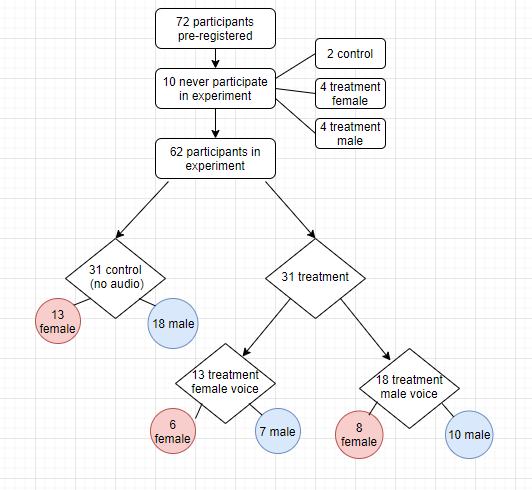
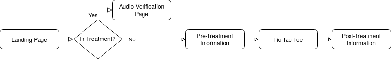
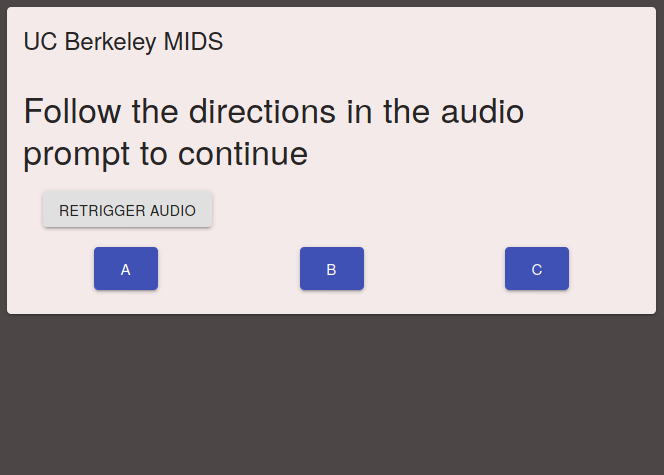
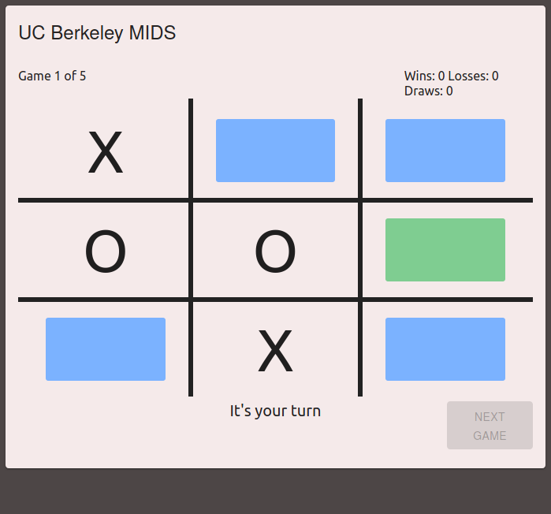

```{r setup, include=FALSE}
knitr::opts_chunk$set(echo = TRUE)
library(tufte)
```

> "I personally take the subway in New York. I love the subway because of the male and female voices that narrate the subway... 
> that man and that woman. The woman who does the subway announcements and her way too loud husband. 
> You know the woman who is like, (in a soft female voice) “The next stop is Christopher Street.” 
> (in a strong male voice) "STAND CLEAR OF THE CLOSING DOORS PLEASE!".
> I asked my friend who works for the city, why is it a male voice and a female voice. And he told me because it’s been proven 
> that people take information from a female voice, but they will only take a warning from a male voice. Now that’s its own 
> American gender nightmare that we don’t have time to get into…"
> `r tufte::quote_footer('--- @mulaney_2019')`

# Introduction
Implicit bias surrounding gender is ever-present in society and, in recent times, more attention has been brought to the issue. The increased attention has given rise to more effort to identify gender biases and attempt to mitigate and remove them. However, even with increased attention to the issue, gender biases persist in our everyday life - from the technologies we use such as voice assistants on smartphones and the audio commands in public service announcements. A CNN article (October 2011) discusses how the choice of the gendered voice of the Siri audio assistant in Apple I-Phone smartphone, which is female in the US market, has to do with biological studies that suggest that people generally find women's voices more pleasing than men's. The same article cites historical references such as the use of female voices in navigation devices during World War II, when women's voices were employed in airplane cockpits because they stood out among the male pilots. Moreover, “telephone operators have traditionally been female, making people accustomed to getting assistance from a disembodied woman's voice.” [@griggs_2011] Recent media reports also cite cases of women in high positions deepening their voices to sound more baritone in order to convey authority (for example, the case of Theranos CEO Elizabeth Holmes) [@hesse_2019]. With this motivation, we pursued identifying the existence of gender bias in giving directions through an experimental study.

## Research Question
The experimental study attempts to isolate the effects that a speaker’s gender has on the willingness of a targeted listener to follow through on the direction of the speaker. The purpose is to provide insight on whether the verbal directions of men are more effective than that of women in steering behavior though some simple game playing. The experiment should serve to examine the existence of the effect and the strength of the effect, if it exists. 

# Experimental Design
## Discussion of the Treatment
In order to estimate the effect of a gender bias in following directions, we designed an online tic-tac-toe game whereby participants hear audio directive cues to make play moves in gendered voices (male or female). The treatment is the audio directive to make a given move while playing tic-tac-toe against a computer adversary as well as a visual indicator over the suggested square to make a move. The control group receives no audio directive, but rather, a visual indicator over the suggested square to make a move. Audio (for the treatment) and visual (for the control) suggestions are provided randomly with some moves provided as optimal moves and other moves as random, likely sub-optimal, suggestions following a random process. 

There are two measured outcomes in the study: (1) the proportion $p_{all}$ of all moves that the subject follows the recommendation of the directive over the course of playing the online tic-tac-toe games; (2) the proportion $p_{optimal}$ of optimal moves that the subject follows the recommendation of the directive over the course of playing the online tic-tac-toe games. The measured outcomes in (1) would presumably prevent the subject from always taking the suggested directive through natural game play since the subjects may receive random sub-optimal directives. If all suggested moves are optimal, as in the case of measured outcomes in (2), the proportion of moves followed would indicate how well subjects follow suggested directives given the treatment received. 

The treatment effect is the mean difference in outcomes between the treatment and control group, given the treatment is received. The experimental concern of interest is how the gender of the speaker affects the experimental subject's willingness to listen in direct comparison to the control group's willingness to listen. Using the measured outcomes in (1) attempts to capture the generalized treatment effect for all suggested moves. Using the measured outcomes in (2) attempts to capture the treatment effect for optimal suggested moves.

## Comparison of Potential Outcomes
The potential outcomes are the proportion of moves made by an experimental subject that follow the directive suggestions in the course of tic-tac-toe game play. There are three types of potential outcomes in the experiment corresponding to the treatment assignments: control (no audio directive), treatment-female (female audio voice directive), and treatment-male (male audio voice directive). Those assigned to receive the control will see a visual suggestion with a square highlighted in the tic-tac-toe board. Formally, the potential outcomes in this study can be described as:
$Y_i(TM=1)$: random variable representing the potential outcomes for a given experimental $i^{th}$ subject receiving the male voice audio treatment. 
$Y_i(TF=1)$: random variable representing the potential outcomes for a given experimental $i^{th}$ subject receiving the female voice audio treatment. 
$Y_i(T=0)$: random variable representing the potential outcomes for a given experimental $i^{th}$ subject receiving the control of no audio treatment, but rather a square highlighted in the tic-tac-toe board.

We can be assured through the construction of the online tic-tac-toe game and careful assignment process that those subjects assigned to the treatment groups will receive the treatment. In other words, those assigned to the treatment group, will not inadvertently not receive the control. Therefore, we can state that  the expected potential outcome for given subject randomly allocated to a treatment group is equal to the expected outcome for a given subject randomly allocated to a treatment group conditional on the subject actually receiving the treatment; formally, $E[Y_i(1)]$ = $E[Y_i(1)|d_i=1]$ for both the treatment-male and treatment-female voice recipients.

The average treatment effect (ATE) can be described as the difference in average outcomes in the treatment and control groups. Formally, this is written as:

The difference in average potential outcomes for subjects in the treatment-male group from the average potential outcomes for subjects in the control group:
$E[Y_i(TM=1)|D_i=1] - E[Y_i(T=0)|D_i=0]$
The difference in average potential outcomes for subjects in the treatment-female group from the average potential outcomes for subjects in the control group:
$E[Y_i(TF=1)|D_i=1] - E[Y_i(T=0)|D_i=0]$

Subjects are randomly assigned to treatment and control groups and therefore, there is no selection bias and we can say the ATE is unbiased. The ATE among randomly treated subjects is the same as the ATE among all subjects.  

We also compare the difference in average potential outcomes across the two treatment groups for further exposition; although this will be lower-powered as we discuss below. 

## Random Assignment
Randomization is done by taking all experimental subjects and assigning roughly half of participants to the control group and the other half to the treatment group, using the `sample` function in R. Given our suspicion that the gender of the experimental subject may influence how (s)he may respond to the treatment, a blocking design was used on the subject’s gender. In this blocking design, a roughly equal proportion of male subjects and female subjects were assigned randomly to treatment and control groups. Subjects in the treatment group were then further randomly assigned to treatment-male and treatment-female groups. 

The following R code snippet demonstrates the subject gender-blocking and randomization approach: 

** [Show blocking and randomization R code here]  **

Following the assignment randomization process, we examine the balance of the subject gender across the treatment and control groups. We find an appropriate level of gender balance across groups that should improve the power of our treatment effect estimates. The higher count of male subjects across all treatment assignment groups reflects the fact that there are more male subjects in the study overall; however, the gender balance is proportionally consistent across treatment assignment groups.

** [Show gender balance check R code here with histogram output] **

## Discussion on Attrition
There were 10 subjects that completed the pre-experiment survey, yet did not actually take the treatment by playing the games. As a result, we observed missing outcome data for these 10 subjects. We viewed this as an innocuous form of attrition since the missing data for the attriters is independent of potential outcomes (missing independent of potential outcomes, $Y_{i}(z) | R_{i}(z)$. This is satisfied by the research design since subjects were divided into random subgroups and outcomes were measured through different randomly assigned exposures unknown in advance. We observe that the attriters were approximately balanced across treatment assignment groups (2 in the control group, 4 in the male voice treatment and 4 in the female voice treatment) and therefore, we do not think that attrition is systematically related to a subject’s potential outcomes. Moreover, in performing a covariate balance check for these attriters, we find these subjects approximately balanced across covariates. Give the benign nature of this attrition, we choose to exclude these subjects with missing outcomes in analyzing the experimental results. 

## Discussion on Non-Compliance
There are two possible forms of non-compliance: (1) not completing the full set of 5 tic-tac-toe games, and (2) choosing not to receive the treatment (i.e. not listen to the audio directive) when playing the game. 

The first form of non-compliance is concerning for the experiment if subjects not completing the 5 tic-tac-toe games are not randomly related with their potential outcomes. That is, those who did not complete the games might be related to their treatment status. We do not view this a concern in the experiment as we found no subjects that did not complete all five tic-tac-toe games once initiating game play. 

The second form of non-compliance here is subtle because we will not know if the participants choose to hear the directive or not (by keeping the audio down or off or listening to something else while playing), even if they complete the game. We do, however, have a screen prompt prior to game play where subjects are forced to verify that their audio is working before advancing to the game. The experiment requires experimental subjects to complete the game in isolation while online, therefore, as researchers, we have no way to tell whether the experimental subjects actually listen to the audio directives. This is a source of potential unobserved error that can undermine the observed treatment effect and a potential limitation of the study.

## Discussion on Excludability
The exclusion restriction is not violated in this study since only the relevant causal agent is the receipt of the treatment. That is, potential outcomes in following suggested directives respond solely to the receipt of the treatment, not to the random assignment of the treatment. Since subjects play the online tic-tac-toe game in isolation and only receive the programmed treatment or control, subjects must only be exposed to the treatment or control. As the experiment has been designed, the same procedures are used to measure outcomes in the treatment and control groups. No other research activities have been performed other than the treatment of interest that differentially impacts treatment and control groups.

Discussion on non-interference
In our experiment, the potential outcomes $Y_{i}(d)$ will be assumed to be unaffected by the treatment of other subjects. Subjects are provided the treatment in isolation and play the online tic-tac-toe game without others around them. Moreover, since the suggested directives are random during game play, one subject’s treatment should not affect another subject’s outcomes. We can say that our experiment upholds the Stable Unit Treatment Value Assumption (SUTVA) or non-interference. 

However, non-interference may be violated if people conspire and speak to each other before, or even during game play. There is a remote possibility of a non-interference violation if, for example, subjects who live in the same household or work for the same company receive treatment and discuss the game dynamics among themselves. These subjects living or working together may infer that they are receiving different treatments and change their behavior in game play from what they otherwise would have had they played in isolation. In our study, there are nine subjects belonging to the same company (United Fire Group) and three people living in the same house. Furthermore, there are also five MIDS students that may be taking W241 or may have taken W241 in the past that may infer something implicitly about the treatment. Again, these students may have the possibility of discussing the treatment among themselves. However, given that we have not communicated who the participants are in this study, we can assume that communication among treated students in the experiment is a remote possibility. We can assume no interdependencies in game play strategy and the assignment of one subject has no consequences for outcomes of other subjects.

## CONSORT
Make clear who was considered for involvement in your experiment, who was assigned, and whose data will eventually be used. Create a flow diagram following page 439 in FE.

The flow diagram starts with 72 subjects who signed up to participate in the study through outreach through social outlets by researchers. The 72 subjects were randomly allocated into three groups - control (no audio directive), treatment (male audio directive) and treatment (female audio directive) following a blocking design based on subject gender (male or female). Following the block randomization, roughly half of subjects were assigned to control (33 subjects) and the other half assigned to one of the treatment groups (39 subjects). Subjects assigned to treatment were randomly assigned to either the male audio directive treatment and female audio directive treatment (22 assigned to the male audio directive and 17 assigned to the female audio directive). Each subject was sent an email to play the series of tic-tac-toe games under their assigned experimental condition (control or treatment). The game play outcomes related to compliance to the directive, by move and overall compliance will be used for estimating the treatment effects. No attrition occurred in this randomized experiment.  

```{r assignment_diagram, fig.cap='Random Assignment Flow Chart', out.width='50%', fig.align='center', echo=FALSE, message=FALSE, warning=FALSE}

```

## Power Calculation
According to List et al. (2008), the power of a statistical test is the probability that it will correctly lead to the rejection of the null hypothesis (the probability of a Type II error is 1-power, and is equal to the probability of falsely not rejecting the null hypothesis). The idea behind the choice of optimal sample sizes in this scenario is that the sample sizes have to be just large enough so that the experimenter (1) does not falsely reject the null hypothesis that the population treatment and control outcomes are equal, i.e., commit a Type I error; and (2) does not falsely accept the null hypothesis when the actual difference is equal to $\delta$, i.e. commit a Type II error. A simple rule of thumb to maximize power given a fixed experimental budget naturally follows: the ratio of the sample sizes is equal to the ratio of the standard deviations of outcomes.


In our experiment, we assume the hypothetical effect size to be achieved should be 0.5, whereby average compliance rate for those in the control is $p$=0.5 and average compliance rate for those in the treatment is $p$=1. We understand that this might be reaching a bit with this hypothetical effect size since an average compliance rate of $p$=1 is the most extreme upward bound. It is likely that the realized treatment effect will be smaller in the experiment.  Below we discuss the effect on power using smaller effect sizes and illustrate the strength of power over effect size-sample size space.

Compute the appropriate sample size for the given effect size, significance level and power. We use the test of proportions. 

** [Include power test code from `genderexperiment_powertest.Rmd` here] **

# Data Collection
Subjects for our experiment were a collection of fellow students in the MIDS program, and the authors’ personal and professional acquaintances. Initial data collection involved sending out a pre-treatment survey in which the respondent is asked to provide their gender, age, and contact information. We use the data collected from this survey to inform our blocking strategy, as described above in the Randomization Process section. One additional step that was included was the creation of a pilot group, which we used to identify any technical bugs in our software infrastructure. This pilot group contained 9 randomly assigned subjects with proportional representation from the full-sized treatment groups, and received treatment before the remainder of the subject pool were contacted to receive treatment.

Treatment was administered via a custom designed web application. Emails were sent to the email addresses that were provided in the pre-treatment survey that contained links to the web application that were unique to the individual subjects, which allowed us to identify which subject was connecting to the web application. If the subject had not completed their assigned task within a week prior to the deadline listed in the email, an additional reminder email is sent out. The script of both of these emails can be found in the appendix.

```{r control_flow, fig.cap='Web-application control flow', out.width='50%', fig.align='center', echo=FALSE, message=FALSE, warning=FALSE}

```
Figure x: Web-application control flow

Upon arrival at the website, the user is greeted with a page that informs the subject that they are expected to fully complete the game, and navigation away from the game will invalidate their results. Those in either treatment group are shown a button which allows them to test their audio. On advancing to the next page of the website, subjects in the treatment group are also greeted with an additional audio test, which requires them to select a button on screen that corresponds to a verbal direction. Subjects in the treatment group are not allowed to advance to subsequent screens if they do not pass this audio validation check. The next page then notifies the user of the game that they will play, and informs them that the move suggestions that they receive may or may not be optimal.


```{r audio_verification, fig.cap='Screenshot of the audio verification page', out.width='50%', fig.align='center', echo=FALSE, message=FALSE, warning=FALSE}

```


```{r game, fig.cap='Screenshot of the tic-tac-toe game', out.width='50%', fig.align='center', echo=FALSE, message=FALSE, warning=FALSE}

```

Once in the game, the users were tasked with completing five games of tic-tac-toe. The opening move alternated between computer and player, with the player getting the opening move in the first game. On each of the subject’s turns, a suggested cell is highlighted to a different color than the other cells. This suggested move is either (with equal probability):
the optimal move as determined by a Minimax decision rule, or 
a randomly selected available cell on the board

This approach for suggesting a position was taken in order to discourage the subject from assuming the suggestions are always optimal or never optimal. The computer opponent follows the same strategy when making their selection. If the subject is in either treatment group, an audio clip is played with a verbal direction to move to the highlighted cell with the gender of the speaker corresponding to the treatment group that the subject belongs to. On the player’s selection of their next move the current board state, selected position, suggested position, and whether the suggested position was optimal are all recorded.

On completion of five games, the subjects are brought to a final screen which thanks them for participating and contains a link to a post-experiment survey. This survey’s results were used to identify any technical glitches and inform some retrospective analysis of the experiment design.

## Model
The main model of our analysis investigates the move compliance rate of the subject dependent on whether the subject was in the control or one of the treatment groups. The regression table below describes this model, first with no covariates, then with additional covariates and robust standard errors.

** [TODO include stargazer plot for suggested move compliance rate] **

From the above plot, we see that voice directives have a statistically significant and positive effect on the willingness of a subject to take the move that was directed. We also see that the female speaker’s voice has a stronger effect on subject move compliance. The coefficient for the age variable does indicate a very small, yet statistically significant, negative effect on the willingness to listen. The coefficient for gender is positive, but insignificant. 

Once we include the interaction terms of age and gender of the subject on treatment, we see that our effects are no longer statistically significant. This can be attributed to the collinearity introduced by including interaction terms, which leads to inflation of the standard errors.

In a separately run t-test we see that the difference between male and female voice directives is not statistically significant. 

** [TODO reference logistic regression all moves model] **

The above model shows the results of our sub-analysis on the effects of the gender of a speaker giving voice directives on a move-by-move basis. This model appears to reinforce the findings of the previous model, which is that audio directives are much more likely to be followed than visual directives. Female speakers still appear to have a stronger positive effect (larger odds of eliciting compliance with the suggested move directive); however, in running a t-test the difference in effects across the two treatment groups are not statistically significant and can not be distinguished from zero.

** [TODO include collapsed optimal/non-optimal models] **

When breaking out comparison down by the optimal and non-optimal moves, we still see that the directives delivered by audio lead to a higher and statistically significant move compliance rate regardless of whether the move is optimal or not. This further supports our initial findings that compliance rates differ between audio and visual directions. We note that the effect is stronger in size for the non-optimal moves for both gendered voices, suggesting that subjects listen regardless of game strategy. 

When examining the comparison between the speaker’s gender, we see again that there is a slightly higher treatment effect for the female speaker, but the difference in effect sizes is not statistically significant.

We also conducted some ancillary analyses on the by order of game and move. Results cited in the appendix.

# Result
The study does not have sufficient power to answer our initial research question of whether the gender of a speaker will affect the willingness of a listener to follow their direction. However, we do see a strong sustained effect of voice directives over visual directives on a subject’s willingness to comply with suggestions. This is supported by our observation of consistently higher compliance rates among those in the treatment compared to those in the control.

We find that the effect of the female speaker is higher than the effect of the male speaker, albeit not a statistically significant difference. It is clear from our experiment that a follow up experiment should be conducted in order to examine this hypothesis more closely. The follow up experiment should include a much larger subject pool and should also include more rigid data collection strategies such that we reduce the number of attriters in the study.
*Story is: We don’t have sufficient power to differentiate between the effects of gender on compliance, but we do see that there is a strong sustained effect of voice directives*

Voice directions have a significant, positive effect (both male and female voice directives) in game play. We find a significant treatment effect in overall comply rates with suggested moves taken and persistence in observing these treatment effects throughout continual game play, on a by-move and by-game basis.
While the effect is slightly stronger for the female voice treatment, we cannot conclude that there is a gender bias in voice directives. The difference in comply rates with suggested moves between male and female voice treatment is not distinguishable from zero. 
Moreover, our study is too low-powered to provide credible evidence of the existence of gendered voice bias one way or the other.


# Conclusions


# Appendix
##Pre-treatment survey
What is your gender? [Multiple Choice]
- Male
- Female
What is your age? [Free-entry]
What is a good contact email? [Free-entry]
Do you consent to taking part in a study that will require you to play a game through a browser based web application with the use of audio (Approximately 10 minutes)? [Multiple Choice]
- Yes
- No

## Post-treatment survey contents
Did you experience any technical issues? [Multiple Choice]
- Yes
- No
If you experienced technical issues please describe below: [Free entry]
Was the audio clear? [Multiple Choice]
How long did it take you (in minutes) to complete the 5 games? If you exited the game early please write NA. [Free-entry]
What is a good contact email? [Free-entry]

## Email scripts
### Initial contact
Hello, and thank you again for agreeing to take part in our study.

Below is a link to the web application where you will play a series of games, which should take no longer than 10 minutes. Please click the link when you are able to complete the game on a computer using Chrome or Firefox in a single session, as you will not be given another attempt to participate if you leave the webpage early. You will also not be allowed to proceed if you attempt to access the page on a mobile device. You must complete this task by {due_date}.

\{external_link\}

Thank you,

UC Berkeley students
School of Information

### Reminder
Hello,

Our records indicate that you have not yet completed the tasks that have been sent to you. Please navigate to the link below and complete the assigned game by {due_date}.

\{external_link\}

Thank you,

UC Berkeley students
School of Information
Web application scripts

## Landing page
### Treatment
Hello, and thank you for agreeing to take part in our study. You will be asked to play 5 short and simple games. It is a requirement that you have headphones or speakers, as there are some audio cues during the course of this activity. You can use the button below to test out the sound on your device. Once you are ready to start playing, please click the START button below. NOTE: If you reload or navigate away from this page before completing all games, your results will be invalidated and you will not be given another opportunity to complete all the games. Please refrain from leaving this webpage without first completing the games.

### Control
Hello, and thank you for agreeing to take part in our study. You will be asked to play 5 short and simple games. Once you are ready to start playing, please click the START button below. NOTE: If you reload or navigate away from this page before completing all games, your results will be invalidated and you will not be given another opportunity to complete all the games. Please refrain from leaving this webpage without first completing the games.

## Pre-treatment information page
### Treatment
You will be asked to play 5 simple games of tic-tac-toe. Before each of your moves, you will hear a speaker suggest a move. These moves may or may not be optimal and you are not required to follow their suggestion. Have fun playing!

### Control
You will be asked to play 5 simple games of tic-tac-toe. Before each of your moves, you will see a suggested move highlighted on the board. These moves may or may not be optimal and you are not required to follow their suggestion. Have fun playing!

## Post-treatment information page
Thank you for playing. Now, please complete the post-game survey by clicking this link.


# Sources Cited